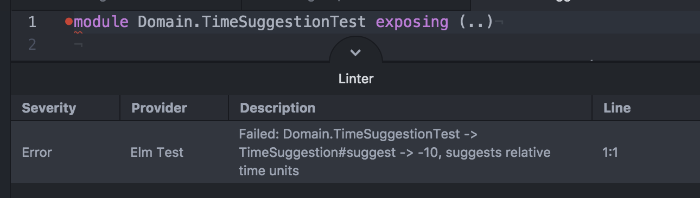

# Atom Elm Test Package

A Elm Test Runner runs your tests your Elm project when you save an Elm file.

It uses the Linter package to show results and jump to failed tests.



## Installation

Make sure your project has Elm-Test installed locally `npm` - meaning in the `devDependencies` section of your
`package.json` file:

```json
    "elm-test": "^0.18.6",
```

Dependencies:

- [Linter](https://atom.io/packages/linter)
- [Elm Test Node Runner](https://github.com/rtfeldman/node-test-runner)

## Contribute

Please create an issue if you find any errors or have suggestions
on how to improve the package. PR's are very welcome as well.

## TODOs

- [ ] Support jumping directly to a failing test's line number, not just the file.
- [ ] Only Activate for Elm Projects.

## Project Sponsor - Humio


[Humio](https://humio.com/)

Humio is a Distributed Log Aggregation and Monitoring System. Humio has a powerful query language and makes it
feel like using `tail` and `grep` with aggregation functions and graphs built-in. It crunches through TB of data in no time at all.
